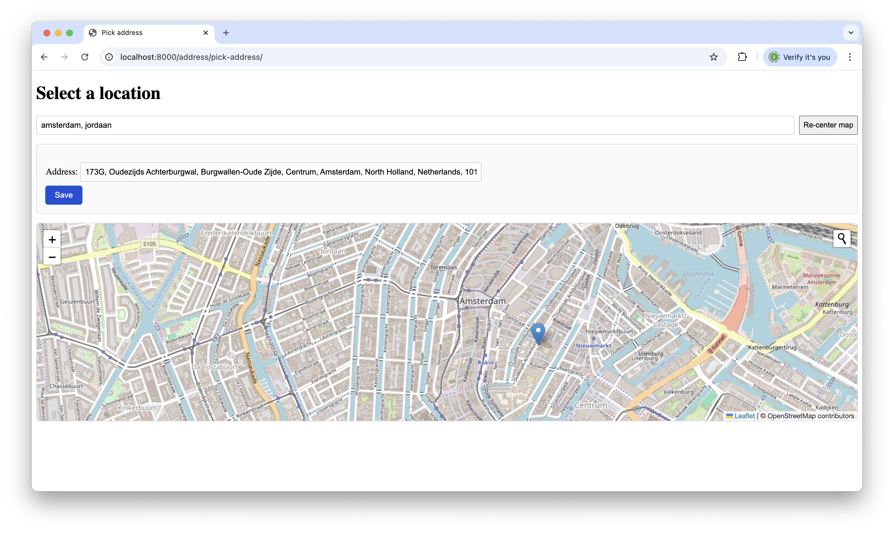
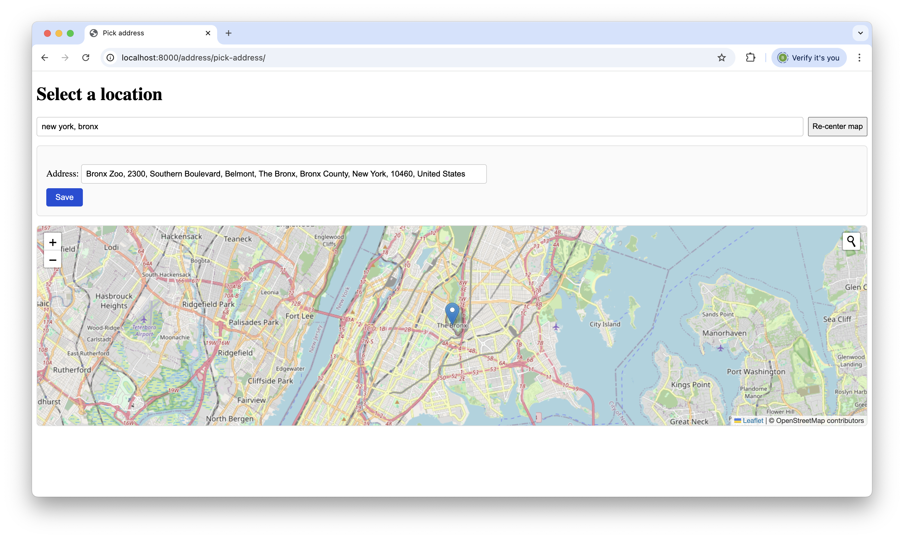
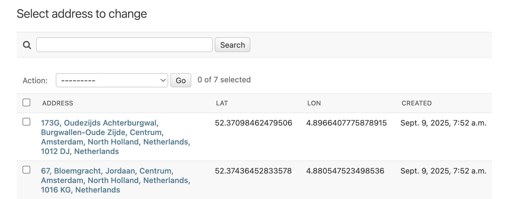

# Leaflet Map Demo

Pick an address on an OpenStreetMap (Leaflet) map and save it in Django — no full page reloads (htmx).

## Features

- 🗺️ Display a Leaflet map (OSM tiles)
- 🔎 Re-center by searching a city (Nominatim search)
- 📍 Click map to reverse-geocode & fill the form
- 💾 Save to DB via htmx (no refresh)

---

## Screenshots

### Pick an address and click 'Save' to store it in the database



### Re-center the map by searching a city or area



### Resulting saved addresses in Django admin



---

## Quickstart

```bash
git clone git@github.com:bbelderbos/leaflet_maps_demo.git
cd leaflet_maps_demo
uv sync
uv run python manage.py migrate
uv run python manage.py createsuperuser
uv run python manage.py runserver
```
